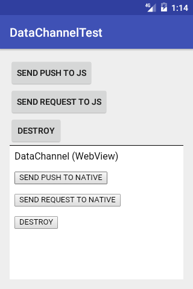

# <p align="center"></p>
DataChannel の Android用の実装を提供します。

## Example 
本リポジトリの [app](app) モジュールが, WebView(HTML) と ネイティブコード(Java) 間の DataChannel で通信をする簡単なサンプルになっています。



このサンプルは, WebView(HTML) と ネイティブコード(Java) の間で DataChannel を接続し, 相互に PUSH（応答を必要としない一方通行のデータ）と REQUEST（応答を必要とする双方向のデータ）を送受信するものです。

- Java: [MainActivity.java](app/src/main/java/jp/co/dwango/cbb/dc/test/MainActivity.java)
- HTML: [index.html](app/src/main/assets/html/index.html), [script.js](app/src/main/assets/html/script.js), [data-channel.js](app/src/main/assets/html/data-channel.js)

## Setup 
### gradle
```
dependencies {
	compile 'jp.co.dwango.cbb:data-channel:2.0.6'
}
```

## Usage
#### step 1: DataChannelを準備
使用するDataBusインスタンスを指定してDataChannelを生成します。

```java
	DataChannel dataChannel = new DataChannel(dataBus);
```

#### step 2: 受信データの受け口を設定
- `DataChannel#addHandler` で受信データの受け口となるハンドラを追加します
- `DataChannelHandler#onRequest` では引数 `callback` に指定されたインタフェースを用いて応答データを返信する必要があります

```java
	dataChannel.addHandler(new DataChannelHandler() {
		@Override
		public void onPush(Object packet) {
			// PUSH (単方向データ) を受信時の処理
		}

		@Override
		public void onRequest(Object packet, DataChannelCallback callback) {
			// REQUEST (双方向データ) を受信時の処理
			// 最後に処理結果を応答する必要がある
			callback.send("response-data");
		}
	});
```

> 追加したハンドラは `DataChannel#removeHandler` または `DataChannel#removeAllHandlers` で解除することができます

#### step 3-1: PUSH (単方向データ) を送信
- `DataChannel#sendPush` で PUSH (単方向データ) を送信することができます
- PUSH は相手からの応答が不要な場合に使用します

```java
	dataChannel.sendPush("push-data");
```

#### step 3-2: REQUEST (双方データ) を送信
- `DataChannel#sendReuqest` で REQUEST (双方向データ) を送信することができます
- REQUEST は相手からの応答が必要な場合に使用します

```java
	dataChannel.sendRequest("request-data", new DataChannelResponseHandler() {
		@Override
		public void onResponse(Object packet) {
			// 正常に応答を受信した時の処理
		}

		@Override
		public void onError(ErrorType errorType) {
			// 正常に応答を受信できなかった時の処理
		}
	});
```

#### step 4: 破棄
`DataChannel#destroy` で破棄できます。

```java
	dataChannel.destroy();
```

> DataChannelをdestroyしても下位層（DataBus）のdestroyは行われません。

## License
- Source code, Documents: [MIT](LICENSE)
- Image files: [CC BY 2.1 JP](https://creativecommons.org/licenses/by/2.1/jp/)

